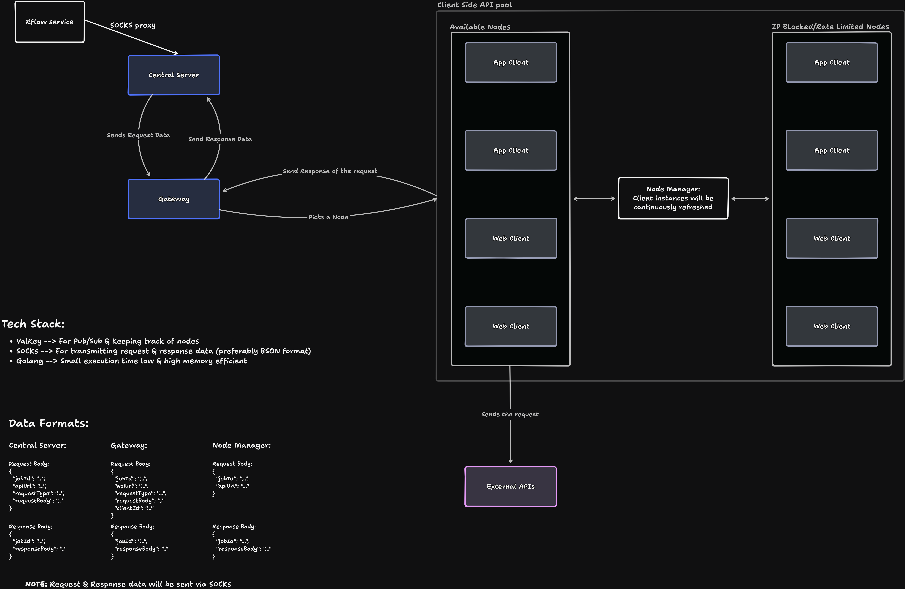

# Distributed Proxy Scrapper (Go)

A high-performance backend system for managing residential proxy nodes using WebSockets and Valkey (Redis-compatible). This service acts as the **central router** that connects API requests to distributed residential nodes and relays responses back in real time.

## Overview

This project implements a **node-based proxy architecture** where:

* Nodes (clients) connect via WebSocket
* Each node acts as an **exit point** for HTTP requests
* The server assigns jobs to nodes
* Nodes execute requests and return results
* The server relays responses back to API consumers

## Architecture

Core Components:

* **Node Manager**

  * Tracks node lifecycle
  * Stores metadata in Valkey
  * Maintains node states: `idle`, `busy`, `blocked`

* **WebSocket Layer**

  * Persistent connection with nodes
  * Handles heartbeat, job dispatch, and result collection

* **Trigger API**

  * Accepts external requests
  * Selects available node
  * Dispatches job
  * Waits for response

* **Valkey**

  * Stores node registry
  * Tracks node status
  * Enables fast lookup


Rough Sketch

## Getting Started

### Backend

1. Install Go 1.26+, docker
2. Install [air](https://github.com/air-verse/air)
3. Clone the repository
3. Run `go mod download`
4. Setup `.env` file with these values:
```sh
VALKEY_HOST=localhost
VALKEY_PORT=6379
PORT=3000
```
6. Run `air` and visit [`http://localhost:3000`](http://localhost:3000)

### Frontend

1. Install Node v24.14.0+
2. Run `cd docs/demo-project`
3. Run `npm i`
4. Run `npm run dev` and visit [`http://localhost:5173`](http://localhost:5173)

### Docs

1. Install [Yaak](https://yaak.app/)
2. Make sure the Backend is running
3. Import `docs/yaak.json`
